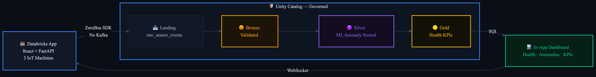

# SmartFactory — IoT Streaming Demo

A customer-facing demo showing how Databricks turns factory sensor data into actionable insights — from machine floor to decision — with no Kafka, no infrastructure to manage, and full governance out of the box.

## What This Demonstrates

| Capability | Business Value |
|---|---|
| **ZeroBus Ingest** | Eliminate Kafka and message bus infrastructure. Sensor data flows directly into governed Delta tables. |
| **SDP Streaming Pipeline** | Catch equipment anomalies as they happen, not in tomorrow's batch report. Continuous, serverless, pure SQL. |
| **ML in the Pipeline** | Every sensor reading scored for anomalies inline — predictive maintenance without a separate ML platform. |
| **Live Operations Dashboard** | Plant managers and technicians see machine health the moment it changes. Faster response, less downtime. |
| **Unity Catalog Governance** | Every table governed from the first byte. Lineage, access control, audit — ready for compliance on day one. |
| **Databricks Apps** | Full-stack app deployed and managed by Databricks. No separate hosting. |
| **DABs** | Entire demo — app, pipeline, dashboard — deploys with a single command. |

## Architecture



## The Machines

| Machine | Sensors | Fault Scenario |
|---|---|---|
| **CNC Mill** | Temperature, Vibration, Spindle RPM | Overheating, vibration spike |
| **Hydraulic Press** | Pressure, Temperature, Cycle Count | Pressure surge, cycle slowdown |
| **Conveyor Belt** | Belt Speed, Load Weight, Motor Current | Speed drop, overcurrent |

## Quick Start

### Prerequisites
- [Databricks CLI](https://docs.databricks.com/dev-tools/cli/index.html) v0.288+ installed
- CLI profile configured for your target workspace
- Node.js 18+ and npm installed
- Python 3 installed
- An existing Unity Catalog catalog with cloud storage configured
- An existing SQL warehouse, unless a warehouse ID is supplied explicitly

### One-command setup
```bash
git clone <repo-url>
cd zerobus-ingest-examples/demos/smart_factory
./setup.sh <databricks-cli-profile> <catalog_name> [schema_name] [warehouse_id]
```

`schema_name` defaults to `smartfactory`. When `warehouse_id` is omitted, the
script selects the first SQL warehouse available to the configured profile.

This script handles everything:
1. Uses the requested SQL warehouse, or finds and starts one when omitted
2. Creates the selected schema and landing table
3. Builds the React frontend
4. Renders workspace-specific app, pipeline, and dashboard configuration
5. Deploys all resources via DABs (app, pipeline, dashboard)
6. Detects the app service principal and grants all permissions
7. Starts the app and deploys its code
8. Configures the SDP pipeline and updates the app with its ID

### After setup
1. Open the app URL printed by the script
2. Click **Streaming** in the header to start the data simulator
3. Click **Start Pipeline** to begin continuous SDP processing
4. Switch between **IoT Simulation** and **Operations Dashboard** tabs
5. Inject faults and watch anomalies flow through the pipeline

> **Important: When you're done demoing, stop the streaming and pipeline!**
> Both consume compute resources. Click **Streaming** (to pause) and **Pipeline Running** (to stop) in the header bar.
> The simulator and pipeline start paused by default — you must manually start them each demo session.

### Redeploying after code changes

Run these commands from `demos/smart_factory` after completing the initial setup,
which creates `app.yaml` and `.generated/`:

```bash
cd frontend && npm run build && cd ..
databricks bundle deploy -t dev -p <databricks-cli-profile> \
  --var="catalog_name=<catalog>" \
  --var="schema_name=<schema>" \
  --var="warehouse_id=<warehouse-id>"
databricks -p <databricks-cli-profile> apps deploy smartfactory-app \
  --source-code-path /Workspace/Users/<workspace-user>/.bundle/smartfactory-demo/dev/files
```

## Project Structure

```
smartfactory-demo/
├── setup.sh                  # One-command setup script
├── databricks.yml            # DABs bundle (app + pipeline + dashboard)
├── app.yaml.template         # Template rendered by setup.sh
├── src/
│   ├── app.py                # FastAPI backend (WebSocket + REST + pipeline control)
│   ├── simulator.py          # 3-machine IoT sensor simulator with fault injection
│   └── zerobus_client.py     # ZeroBus SDK wrapper with SQL INSERT fallback
├── pipeline/
│   ├── bronze.sql.template   # Ingestion template rendered by setup.sh
│   ├── silver.sql            # Anomaly scoring via threshold JOIN (streaming table)
│   └── gold.sql              # Health KPIs + anomaly timeline (materialized views)
├── dashboards/
│   └── smartfactory.lvdash.json.template
├── frontend/
│   ├── src/
│   │   ├── App.tsx           # Tabbed layout (IoT Simulation + Dashboard)
│   │   ├── components/
│   │   │   ├── FactoryFloor  # SVG machine visuals with live sensor readouts
│   │   │   ├── MachineCard   # Per-machine gauge cards
│   │   │   ├── SensorGauge   # Circular SVG gauge component
│   │   │   ├── ControlPanel  # Fault injection buttons
│   │   │   ├── EventFeed     # Live scrolling event log
│   │   │   ├── DashboardView # Charts, KPI tables, anomaly log
│   │   │   └── PipelineBanner# Pipeline flow + UC governance badge
│   │   └── hooks/
│   │       └── useWebSocket  # Auto-reconnecting WebSocket hook
│   └── dist/                 # Pre-built frontend (deployed with app)
└── .generated/               # Workspace-specific files created by setup.sh
```

## Tech Stack

| Layer | Technology |
|---|---|
| Frontend | React 18, TypeScript, Vite, TailwindCSS, Recharts |
| Backend | FastAPI, Uvicorn, WebSocket |
| Ingestion | ZeroBus SDK (with SQL INSERT fallback) |
| Pipeline | SDP (Spark Declarative Pipelines), serverless |
| ML | SQL threshold-based anomaly detection in SDP Silver layer |
| Governance | Unity Catalog (lineage, access control, audit) |
| Deployment | Databricks Asset Bundles (DABs) |
| Dashboard | Lakeview (AI/BI) + in-app React dashboard |
